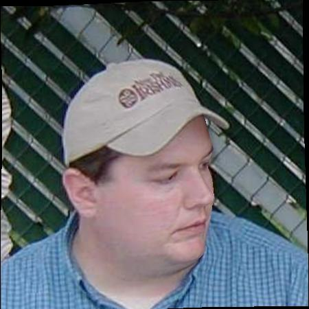

# prnet_from_scratch
From scratch implementation of the paper: "[Joint 3D Face Reconstruction and Dense Alignment with Position Map Regression Network](https://arxiv.org/abs/1803.07835)" ECCV 2018

# Generate Ground Truth
Download the [300W_LP dataset](http://www.cbsr.ia.ac.cn/users/xiangyuzhu/projects/3DDFA/main.htm), and the Basel Face Model (BFM) [here](https://faces.dmi.unibas.ch/bfm/index.php?nav=1-1-0&id=details) or [here](https://github.com/yfeng95/face3d/issues/95). 

Run the script:
```
python generate_gt_offline.py prnet/config/prnet_config.yaml /path/to/destination
```

# Train
```
python train.py prnet/config/prnet_config.yaml
```

# Examples
Qualitative examples of a model trained for 25 epochs on the AFW portion of the 300W_LP dataset.

| Image                                   | Predictions vs GT           | Prediction Error          |
| --------------------------------------- | --------------------------- | ------------------------- |
|   |  |  |
|      |  |  |
|  |  |  |


> Note: This reporistory is just for learning purposes and does not aim to reproduce the results of the [official implementation](https://github.com/yfeng95/PRNet). Additionally, the above examples are shown only for the reconstruction task (alignment is not learned). Finally, most of the code for the ground truth generation was borrowed from [yfeng95/face3d](https://github.com/yfeng95/face3d).